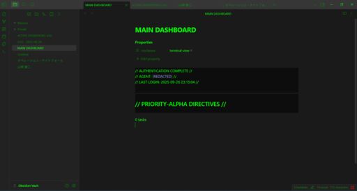
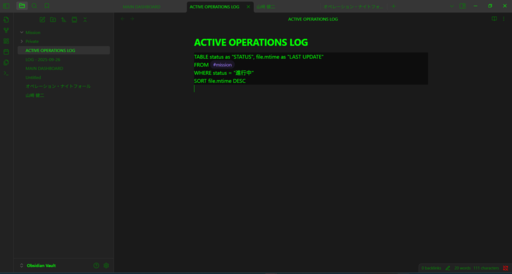
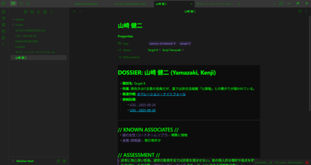
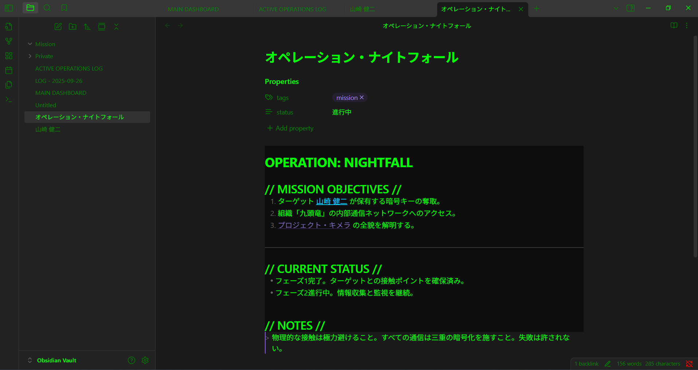
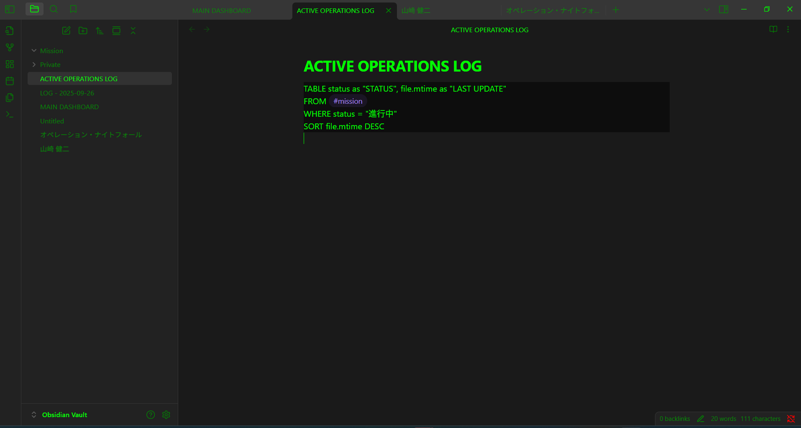

# Spy Terminal

<div align="center">


**A spy movie-style terminal theme for Obsidian and other Markdown editors**

*Experience coding and note-taking with the atmosphere of hacker movies*

</div>

## 🎬 Theme Features

### 🖥️ **Authentic Terminal Experience**
- **Monospace Fonts**: Terminal-style fonts like SFMono-Regular, Roboto Mono, Ubuntu Mono
- **16px Font Size**: Easy to read and comfortable for long work sessions

### 🌙 **Dark Theme Design**
- **Dark Gray/Black Background**: Eye-friendly dark background colors
- **Three-tier Background**: Primary, secondary, and tertiary backgrounds for hierarchy

### 💚 **Classic Green Text**
- **Main Text**: Vibrant green (#00ff00) for classic terminal feel
- **Muted Text**: Darker green (#008800) for hierarchy
- **Error Text**: Red (#ff0000) for important information

### ✨ **Visual Effects**
- **Glow Effects**: Glowing effects on links and task blocks for spy atmosphere
- **Text Shadow**: Subtle glowing effects on links
- **Box Shadow**: Green glow effects on task blocks

### ☑️ **Interactive Elements**
- **Custom Checkboxes**: Green checkboxes for task management
- **Cyan Links**: Links highlighted in cyan (#00ccff)
- **Text Selection**: Green semi-transparent text selection

### 📝 **Code Blocks**
- **Dark Background**: Very dark background (#0d0d0d) to make code stand out
- **Green Text**: Code text also in green for consistency
- **Task Queries**: Special styling for task blocks

## 📸 Screenshots

<div align="center">

### 🎯 Main Dashboard
*Integrated management of classified information - Authentication complete and high-priority directives*



### 📝 Active Operations Log
*Real-time mission status monitoring - Dataview queries for ongoing missions*



### 👤 Person File
*Target detailed information management - Detailed profile of Kenji Yamazaki*



### 🎬 Spy Terminal Atmosphere
*Immersive hacker movie experience - 3-pane display for integrated information management*



### 📊 Graph View
*Personnel relationships and operations visualization - Kenji Yamazaki centered relationships*



</div>

### 🌟 Screenshot Features

- **🖥️ Authentic Terminal Experience**: Classic terminal feel with monospace fonts and green text
- **📊 Data Visualization**: Graph view for understanding personnel relationships and operations
- **📝 Real-time Monitoring**: Task management and Dataview queries for mission tracking
- **👤 Information Management**: Person files for systematic target information management
- **🎬 Immersive Experience**: Enjoy coding and note-taking with spy movie atmosphere

## 🚀 Installation

### For Obsidian

1. Download the `theme.css` file
2. Go to Obsidian Settings → Appearance → Themes → Custom CSS
3. Copy and paste the file contents
4. Enable the theme

### For Other Markdown Editors

Place the CSS file in the appropriate location and load it as custom CSS in your editor's settings.

## 🎨 Customization

The theme can be customized using the following CSS variables:

```css
--background-primary: #1a1a1a;    /* Main background color */
--text-normal: #00ff00;           /* Normal text color */
--link-color: #00ccff;            /* Link color */
--text-error: #ff0000;            /* Error text color */
```

## 💝 Support

If you like this theme, I would be very happy if you could support me with a cup of coffee!

<div align="center">

[](https://buymeacoffee.com/saeli)

**Your support drives better theme development!**

</div>

## 📄 License

MIT License

## 👨‍💻 Author

**IchiroFukuda**

- GitHub: [@IchiroFukuda](https://github.com/IchiroFukuda)
- Buy Me a Coffee: [buymeacoffee.com/saeli](https://buymeacoffee.com/saeli)

---

<div align="center">

**⭐ Star this repository and enjoy the spy terminal coding experience! ⭐**

</div>
