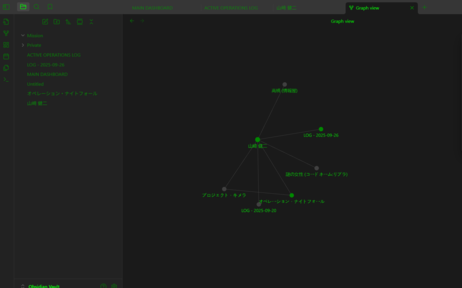

# スパイ端末風テーマ (Spy Terminal Theme)

<div align="center">


**Obsidianやその他のMarkdownエディタ用のスパイ映画風端末テーマ**

*ハッカー映画のような雰囲気でコーディングとメモ取りを楽しもう*

</div>

## 🎬 テーマの特徴

### 🖥️ **本格的な端末体験**
- **モノスペースフォント**: SFMono-Regular、Roboto Mono、Ubuntu Monoなどの端末風フォント
- **16px フォントサイズ**: 読みやすく、長時間の作業でも疲れにくい設定

### 🌙 **ダークテーマデザイン**
- **濃いグレー/黒の背景**: 目に優しい暗い背景色
- **3段階の背景色**: プライマリ、セカンダリ、ターシャリの背景で階層を表現

### 💚 **クラシックな緑色テキスト**
- **メインテキスト**: 鮮やかな緑色（#00ff00）でクラシックな端末感を演出
- **薄いテキスト**: 暗めの緑色（#008800）で階層を表現
- **エラーテキスト**: 赤色（#ff0000）で重要な情報を強調

### ✨ **視覚効果**
- **グローエフェクト**: リンクやタスクブロックに光る効果でスパイ感を演出
- **テキストシャドウ**: リンクに微細な光る効果を追加
- **ボックスシャドウ**: タスクブロックに緑色のグロー効果

### ☑️ **インタラクティブ要素**
- **カスタムチェックボックス**: 緑色のチェックボックスでタスク管理
- **シアン系リンク**: リンクをシアン色（#00ccff）で目立たせる
- **選択範囲**: 緑色の半透明でテキスト選択を強調

### 📝 **コードブロック**
- **暗い背景**: 非常に暗い背景（#0d0d0d）でコードを際立たせる
- **緑色テキスト**: コード内のテキストも緑色で統一
- **タスククエリ**: 特別なタスクブロック用のスタイリング

## 📸 スクリーンショット

<div align="center">

### 🎯 メインダッシュボード
*機密情報の統合管理画面 - 認証完了と優先度の高い指令を表示*


### 📝 アクティブオペレーションログ
*リアルタイムの作戦状況監視 - Dataviewクエリで進行中ミッションを表示*



### 👤 人物ファイル
*ターゲットの詳細情報管理 - 山崎健二の詳細なプロファイル*


### 🎬 スパイ端末の雰囲気
*ハッカー映画のような没入感 - 3ペイン表示で情報を統合管理*


### 📊 グラフビュー
*人物関係と作戦の可視化 - 山崎健二を中心とした関係性を表示*


</div>

### 🌟 スクリーンショットの特徴

- **🖥️ 本格的な端末体験**: モノスペースフォントと緑色テキストでクラシックな端末感を再現
- **📊 データ可視化**: グラフビューで人物関係や作戦の全体像を把握
- **📝 リアルタイム監視**: タスク管理とDataviewクエリで作戦状況を追跡
- **👤 情報管理**: 人物ファイルでターゲットの詳細情報を体系的に管理
- **🎬 没入感**: スパイ映画のような雰囲気でコーディングとメモ取りを楽しめる

## 🚀 インストール方法

## インストール方法

### Obsidianの場合

1. `spy-terminal-theme.css` ファイルをダウンロード
2. Obsidianの設定 → 外観 → テーマ → カスタムCSS に移動
3. ファイルの内容をコピー&ペースト
4. テーマを有効化

### その他のMarkdownエディタ

CSSファイルを適切な場所に配置し、エディタの設定でカスタムCSSとして読み込んでください。

## カスタマイズ

テーマは以下のCSS変数でカスタマイズ可能です：

```css
--background-primary: #1a1a1a;    /* メイン背景色 */
--text-normal: #00ff00;           /* 通常テキスト色 */
--link-color: #00ccff;            /* リンク色 */
--text-error: #ff0000;            /* エラーテキスト色 */
```

## 💝 支援のお願い

このテーマが気に入っていただけましたら、コーヒー一杯分の支援をいただけると大変嬉しいです！

<div align="center">

[](https://buymeacoffee.com/saeli)

**あなたの支援が、より良いテーマ開発の原動力になります！**

</div>

## 📄 ライセンス

MIT License

## 👨‍💻 作者

**IchiroFukuda**

- GitHub: [@IchiroFukuda](https://github.com/IchiroFukuda)
- Buy Me a Coffee: [buymeacoffee.com/saeli](https://buymeacoffee.com/saeli)

---

<div align="center">

**⭐ このリポジトリをスターして、スパイ端末風のコーディング体験を楽しんでください！ ⭐**

</div>
